  
  
# 自动编码(AE)器的简单实现
  
  
## 一.目录
  
  
- [自动编码(AE)器的简单实现](#%E8%87%AA%E5%8A%A8%E7%BC%96%E7%A0%81ae%E5%99%A8%E7%9A%84%E7%AE%80%E5%8D%95%E5%AE%9E%E7%8E%B0)
  - [一.目录](#%E4%B8%80%E7%9B%AE%E5%BD%95)
  - [二.自动编码器的发展简述](#%E4%BA%8C%E8%87%AA%E5%8A%A8%E7%BC%96%E7%A0%81%E5%99%A8%E7%9A%84%E5%8F%91%E5%B1%95%E7%AE%80%E8%BF%B0)
    - [2.1 自动编码器(Auto-Encoders,AE)](#21-%E8%87%AA%E5%8A%A8%E7%BC%96%E7%A0%81%E5%99%A8auto-encodersae)
    - [2.2 降噪自编码(Denoising Auto-Encoders, DAE)(2008)](#22-%E9%99%8D%E5%99%AA%E8%87%AA%E7%BC%96%E7%A0%81denoising-auto-encoders-dae2008)
    - [2.3 堆叠降燥自动编码器 (Stacked Denoising Auto-Encoders, SAE)(2008)](#23-%E5%A0%86%E5%8F%A0%E9%99%8D%E7%87%A5%E8%87%AA%E5%8A%A8%E7%BC%96%E7%A0%81%E5%99%A8-stacked-denoising-auto-encoders-sae2008)
    - [2.4 卷积自动编码器(Convolution Auto-Encoders, CAE)(2011)](#24-%E5%8D%B7%E7%A7%AF%E8%87%AA%E5%8A%A8%E7%BC%96%E7%A0%81%E5%99%A8convolution-auto-encoders-cae2011)
    - [2.5 变分自动编码器(Variational Auto-Encoders, VAE)(Kingma, 2014)](#25-%E5%8F%98%E5%88%86%E8%87%AA%E5%8A%A8%E7%BC%96%E7%A0%81%E5%99%A8variational-auto-encoders-vaekingma-2014)
    - [2.5 几种算法的改进点表格](#25-%E5%87%A0%E7%A7%8D%E7%AE%97%E6%B3%95%E7%9A%84%E6%94%B9%E8%BF%9B%E7%82%B9%E8%A1%A8%E6%A0%BC)
  - [三. 实验](#%E4%B8%89-%E5%AE%9E%E9%AA%8C)
    - [3.1 传统的自动编码器实验结果](#31-%E4%BC%A0%E7%BB%9F%E7%9A%84%E8%87%AA%E5%8A%A8%E7%BC%96%E7%A0%81%E5%99%A8%E5%AE%9E%E9%AA%8C%E7%BB%93%E6%9E%9C)
      - [模型结构与实现代码](#%E6%A8%A1%E5%9E%8B%E7%BB%93%E6%9E%84%E4%B8%8E%E5%AE%9E%E7%8E%B0%E4%BB%A3%E7%A0%81)
      - [训练过程](#%E8%AE%AD%E7%BB%83%E8%BF%87%E7%A8%8B)
      - [编码器输出的可视化结果](#%E7%BC%96%E7%A0%81%E5%99%A8%E8%BE%93%E5%87%BA%E7%9A%84%E5%8F%AF%E8%A7%86%E5%8C%96%E7%BB%93%E6%9E%9C)
      - [说明与讨论](#%E8%AF%B4%E6%98%8E%E4%B8%8E%E8%AE%A8%E8%AE%BA)
    - [3.2 堆叠降噪自编码器](#32-%E5%A0%86%E5%8F%A0%E9%99%8D%E5%99%AA%E8%87%AA%E7%BC%96%E7%A0%81%E5%99%A8)
      - [模型结构与实现代码](#%E6%A8%A1%E5%9E%8B%E7%BB%93%E6%9E%84%E4%B8%8E%E5%AE%9E%E7%8E%B0%E4%BB%A3%E7%A0%81-1)
      - [训练过程](#%E8%AE%AD%E7%BB%83%E8%BF%87%E7%A8%8B-1)
      - [编码器输出的可视化结果](#%E7%BC%96%E7%A0%81%E5%99%A8%E8%BE%93%E5%87%BA%E7%9A%84%E5%8F%AF%E8%A7%86%E5%8C%96%E7%BB%93%E6%9E%9C-1)
      - [说明与讨论](#%E8%AF%B4%E6%98%8E%E4%B8%8E%E8%AE%A8%E8%AE%BA-1)
    - [3.3 卷积自编码器](#33-%E5%8D%B7%E7%A7%AF%E8%87%AA%E7%BC%96%E7%A0%81%E5%99%A8)
      - [模型结构与实现代码](#%E6%A8%A1%E5%9E%8B%E7%BB%93%E6%9E%84%E4%B8%8E%E5%AE%9E%E7%8E%B0%E4%BB%A3%E7%A0%81-2)
      - [训练过程](#%E8%AE%AD%E7%BB%83%E8%BF%87%E7%A8%8B-2)
      - [编码器输出的可视化结果](#%E7%BC%96%E7%A0%81%E5%99%A8%E8%BE%93%E5%87%BA%E7%9A%84%E5%8F%AF%E8%A7%86%E5%8C%96%E7%BB%93%E6%9E%9C-2)
    - [3.4 变分自编码器](#34-%E5%8F%98%E5%88%86%E8%87%AA%E7%BC%96%E7%A0%81%E5%99%A8)
      - [模型结构与实现代码](#%E6%A8%A1%E5%9E%8B%E7%BB%93%E6%9E%84%E4%B8%8E%E5%AE%9E%E7%8E%B0%E4%BB%A3%E7%A0%81-3)
      - [训练过程](#%E8%AE%AD%E7%BB%83%E8%BF%87%E7%A8%8B-3)
      - [自编码器输出的可视化结果](#%E8%87%AA%E7%BC%96%E7%A0%81%E5%99%A8%E8%BE%93%E5%87%BA%E7%9A%84%E5%8F%AF%E8%A7%86%E5%8C%96%E7%BB%93%E6%9E%9C)
  - [四.讨论](#%E5%9B%9B%E8%AE%A8%E8%AE%BA)
  - [参考文献](#%E5%8F%82%E8%80%83%E6%96%87%E7%8C%AE)
  
## 二.自动编码器的发展简述
  
  
### 2.1 自动编码器(Auto-Encoders,AE)
  
  
传统的自动编码器是一种数据的压缩算法，其算法包括编码阶段和解码阶段，且拥有对称的结构。
目前自编码器的应用主要有两个方面，第一是数据去噪，第二是为进行可视化而降维。配合适当的维度和稀疏约束，自编码器可以学习到比PCA等技术更有意思的数据投影。
  
传统编码器的编解码过程描述如图：
  
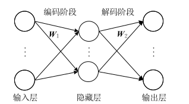
  
其中过程可以使用如下公式描述：
  
<p align="center"></p>  
  
<p align="center"></p>  
  
  
其中,为编码的权重和偏置，,为解码的权重和偏置。
  
损失函数描述为如下形式:
  
<p align="center"></p>  
  
  
自动编码器的训练过程使用传统的基于梯度的方式进行训练。
  
**评价:**
  
学界评价:传统自编码器的目的是使输出与输入尽量相同，这完全可以通过学习两个恒等函数来完成，但是这样的变换没有任何意义，因为我们真正关心的是隐层表达，而不是实际输出。因此，针对自编码器的很多改进方法都是对隐层表达增加一定的约束，迫使隐层表达与输入不同。
  
  
### 2.2 降噪自编码(Denoising Auto-Encoders, DAE)(2008)
  
  
自编码器真正关心的是隐藏层的特征表达，一个好的表达能够捕获输入信号的稳定结构，以该目的为出发出现了降噪自动编码器。降噪自动编码器，首先对干净的输入信号加入噪声产生一个受损的信号。然后将受损信号送入传统的自动编码器中，使其重建回原来的无损信号。
  
降噪自编码器的编解码过程描述如图：
  
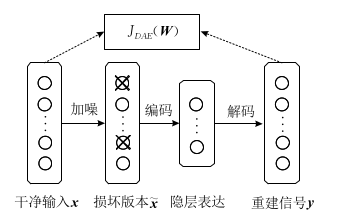
  
其中过程可以使用如下公式描述：
  
<p align="center"></p>  
  
<p align="center"></p>  
  
<p align="center"></p>  
  
  
其中为噪声的分布， 为加入噪声后的输入， ,为编码的权重和偏置，,为解码的权重和偏置。
  
降噪自编码器的目标是最小化损失函数。
  
<p align="center"></p>  
  
  
降噪自编码器与传统的自动编码器的主要区别在于:
1. 降噪自编码器通过人为的增加噪声使模型获得鲁棒性的特征表达
2. 避免使隐层单元学习一个传统自编码器中没有意义的恒等函数
  
**评价:**
  
学界评价:降噪自编码器通过对输入信号人为地进行损坏，主要是为了达到两个目的，首先是为了避免使隐层单元学习一个传统自编码器中没有实际意义的恒等函数，其次就是为了使隐层单元可以学习到一个更加具有鲁棒性的特征表达。
降噪自编码器最大的优点在于，重建信号对输入中的噪声具有一定的鲁棒性，而最大的缺陷在于每次进行网络训练之前，都需要对干净输入信号人为地添加噪声，以获得它的损坏信号，这无形中就增加了该模型的处理时间。
  
  
### 2.3 堆叠降燥自动编码器 (Stacked Denoising Auto-Encoders, SAE)(2008)
  
  
参考深度置信网络的方法，将降噪自编码器进行堆叠可以构造成堆叠降噪自编码器。与自编码器和降噪自编码器不同，堆叠降噪自编码器的提出是为了解决。
  
降噪自编码器的编解码过程描述如图：
  
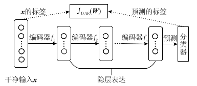
  
其中,编码器  分别对应的是预先训练好的降噪自编码器到的编码函数.
  
每个子问题的训练过程与降噪自编码器自编码器相同.
  
整个堆叠降噪自编码器的训练过程如下:
  
* 1. 干净输入输入
* 2. 加入噪声,和与对应的解码器使用降噪自编码器的方式训练.
* 3. 固定,以与步骤2相同的方式训练到,并在最后一层加入分类器
* 4. 利用的真实标签和预测获得的标签进行有监督学习.对整个网络参数进行进一步的微调.
  
其中为噪声的分布， 为加入噪声后的输入， ,为编码的权重和偏置，,为解码的权重和偏置。
  
堆叠降噪自编码器与降噪自编码器的区别在于:
1. 堆叠降噪自编码器采用了降噪编码器的编码器作为基础单元,并且使用其训练方法进行预训练
2. 降噪自动编码器是无监督学习(自监督)的一种方法,而降噪自编码器是一种有监督方法.
  
**评价:**
  
学界评价:堆叠降噪自编码器是降噪自编码器的一个应用方法.
  
  
### 2.4 卷积自动编码器(Convolution Auto-Encoders, CAE)(2011)
  
  
全卷积网络是一种面向特定应用(图像语义分割)的卷积神经网络,其结构图如下图所示:
  

  
与经典的CNN在卷积层之后使用全连接层得到固定长度的特征向量进行分类（全联接层＋softmax输出）不同，FCN可以接受任意尺寸的输入图像，采用反卷积层对最后一个卷积层的feature map进行上采样, 使它恢复到输入图像相同的尺寸，从而可以对每个像素都产生了一个预测, 同时保留了原始输入图像中的空间信息, 最后在上采样的特征图上进行逐像素分类。
  
与全卷积网络类似的一种无监督方法称为卷机自动编码器.
  
由于卷积神经网络所取得的各种优异表现，直接推动了卷积自编码器的产生.卷积自编码器属于传统自编码器的一个特例.它使用卷积层和池化层替代了原来的全连接层.卷积
自编码器能很好的保留二维信号的空间信息.
  
学界评价:其主要差别在于卷积自编码器采用卷积方式对输入信号进行线性变换，并且其权重是共享的，这点与卷积神经网络一样。因此，重建过程就是基于隐藏编码的基本图像块的线性组合。
  
我实现后的感受:
  
### 2.5 变分自动编码器(Variational Auto-Encoders, VAE)(Kingma, 2014)
  
  
变分自编码器是一种主要用于数据生成的自编码器的变体.当作为生成模型时,首先利用数据训练变分自编码器,然后只使用变分自编码器的解码部分,自动生成与训练数据类似的输出.
  
其结构图如图所示:
  
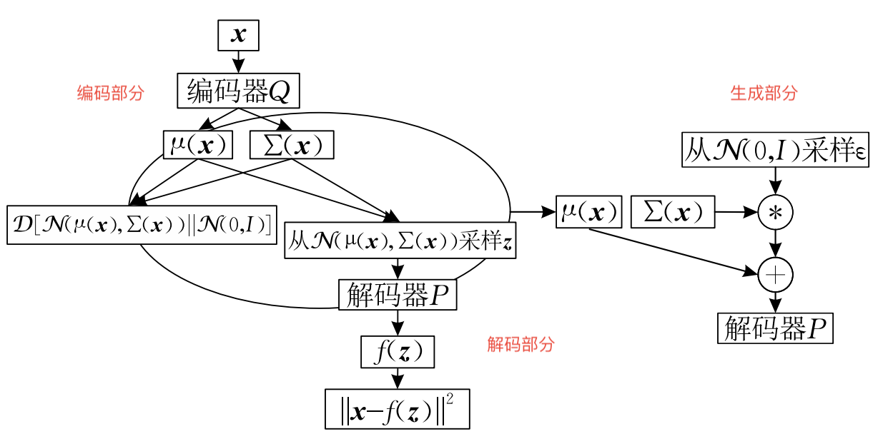
  
整个结构可以分成三个部分,分别是编码部分,解码部分和生成部分.编码部分和解码部分同时进行训练,目标函数是从KL散度的概念中推倒得到的.
  
其中代表了输入数据,代表了隐变量(latent varibles)(一个类似隐层输出的概率描述),
变分编码器的目标可以描述为最大化生成的概率
  
<p align="center"></p>  
  
  
其中  为模型的参数,也是优化的对象.一般选取
  
loss函数的推导过程:
  
首先我们希望编码器部分生成的随机变量与理想的尽量接近,因此使用KL散度的概念对两个随机变量的相似性进行描述.
  
<p align="center"></p>  
  
  
其中,为散度符号.利用贝叶斯公式将上述公式展开得到:
  
<p align="center"></p>  
  
  
经过变换可以得到:
  
<p align="center"></p>  
  
该公式正好是变分自编码器的目标函数.目标函数可以分成两个部分,分别约束了中间的隐变量受到一个标准分布的约束和输出图像尽量与原图相同.
  
  
### 2.5 几种算法的改进点表格
  
  
| 编码器名称   | 提出时间 | 改进点                                                                                          | 目的                                                      |
| ------------ | -------- | ----------------------------------------------------------------------------------------------- | --------------------------------------------------------- |
| 传统自编码器 | 1986     | 无                                                                                              | 无                                                        |
| 降噪自编码器 | 2008     | 将带有噪声的损坏信息作为输入信号                                                                | 使重建信号鲁棒性更强                                      |
| 堆叠自编码器 | 2008     | 将多层结构和栈式训练引入自编码器                                                                | 使自编码器可以训练更高层数                                |
| 卷积自编码器   | 2011     | 将卷积层引入自编码器                                                                            | 更好的处理图片数据,得到更好的效果                         |
| 变分自编码器   | 2014     | 相当于在传统自编码器的隐层表达上增加一个对隐变量的约束,提出了一种将概率模型和神经网络结构的方法 | 使编码器产生的隐层表达满足正态分布,能够更好的生成图像模型 |
  
  
## 三. 实验
  
  
### 3.1 传统的自动编码器实验结果
  
#### 模型结构与实现代码
  
  
传统的自动编码器分为编码器部分和解码器部分,整体模型结构如图所示:
  
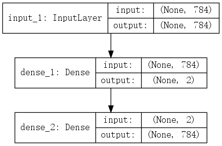
  
模型分为三个子模块,由上至下分别为输入层,编码器层和解码器层,编码器将输入维度为784(28 * 28)的mnint灰度值转化为一个维度为2的值.编码器将维度为2的值解码回维度为784(28 * 28)的mnint灰度值.
  
使用python-keras代码实现关键代码如下.
  
```python
    def __init__(self, ENCODING_DIM_INPUT=784, ENCODING_DIM_OUTPUT=2, Name = "ae"):
  
        input_image = Input(shape=(ENCODING_DIM_INPUT, ))
  
        # encoding layer
        hidden_layer = Dense(ENCODING_DIM_OUTPUT, activation='relu')(input_image)
        # decoding layer
        decode_output = Dense(ENCODING_DIM_INPUT, activation='relu')(hidden_layer)
  
        # build autoencoder, encoder, decoder
        autoencoder = Model(inputs=input_image, outputs=decode_output)
        encoder = Model(inputs=input_image, outputs=hidden_layer)
  
        # compile autoencoder
        autoencoder.compile(optimizer='adam', loss='mse', metrics=['accuracy'])
  
        self.autoencoder = autoencoder
        self.encoder = encoder
```
  
#### 训练过程
  
  
本实验讨论使用relu和tanh两种激活函数的自监督训练的情况.训练的loss函数选择为方均根误差.
训练过程的loss变化图像如下.
  
使用tanh作为激活函数时,loss变化情况如下.
  
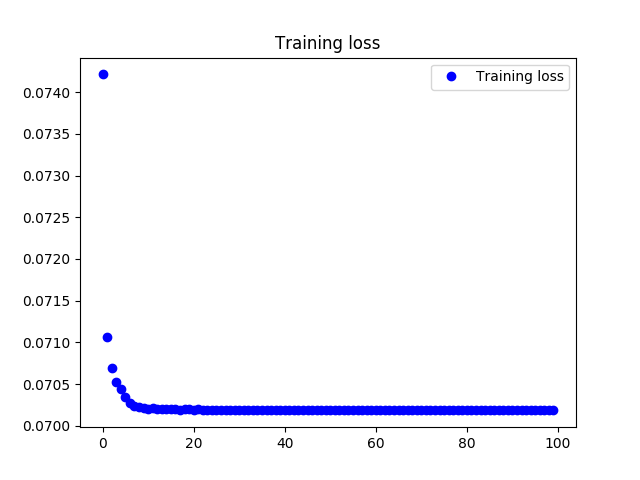
  
可以观察到,loss收敛到0.0685,效果较好.使用relu作为激活函数同样能够有效收敛,不过误差数值相对较大.由于篇幅原因不将图片在此进行展示.误差数值相对较大的原因将在下一节进行讨论.
  
#### 编码器输出的可视化结果
  
  
本节将从重建图像和编码器输出层的二维可视化图像两部分进行展示,分别展示使用tanh和relu两种损失函数的训练结果.
  
训练好的自动编码器重建图像(使用relu激活函数)如下图:
  

  
训练好的自动编码器重建图像(使用tanh激活函数)如下图:
  
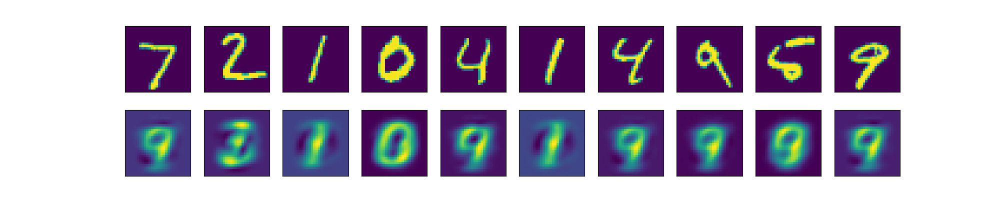
  
两者对比可以发现relu函数训练出的模型存在一些像素颗粒,这也验证了上一节loss函数较大的实验结果.为了解释该问题,展示编码器输出层的二维可视化图片.
  
训练好的编码器输出图像(使用relu激活函数)如下图:
  
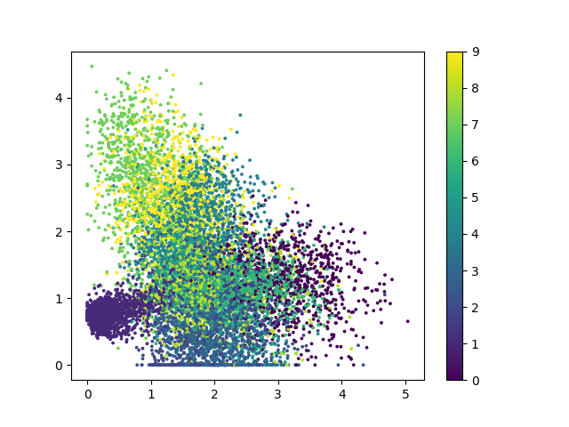
  
训练好的编码器输出图像(使用tanh激活函数)如下图:
  
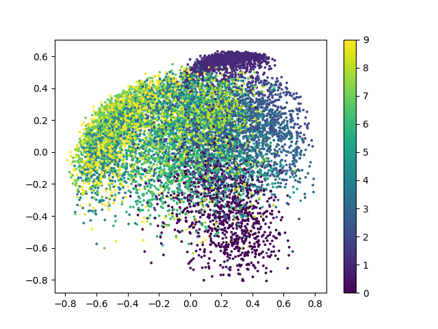
  
以上两张图片是 编码器-解码器 结构中编码器部分的输出绘制成的二维可视化图片,不同的颜色代表了不同的数字,对应的数字在右边的图例中进行了显示.从以上两张图片中可以得到:
1. 由于relu函数对负数的截断性质,使用relu激活函数训练的模型中有一部分点被限制在x=0,y=0两条边缘线上,这也是上文中提到的训练误差较大和出现像素颗粒的原因.
2. 自动编码器虽然能够对mnist数据集进行编码和解码,但是效果并没有其改进的其他方法理想,这一观点可以从解码图片较为模糊和编码器可视化后各个类别的分类相重合得到验证.
  
#### 说明与讨论
  
  
传统自编码器有很大的改进空间,改进空间的可以从几个方面阐述:
1. 解码器输出较为模糊
2. 编码器可视化的类别间的界限不明显
  
  
  
### 3.2 堆叠降噪自编码器
  
#### 模型结构与实现代码
  
  
传统的自动编码器分为编码器部分和解码器部分,整体模型结构如图所示:
  
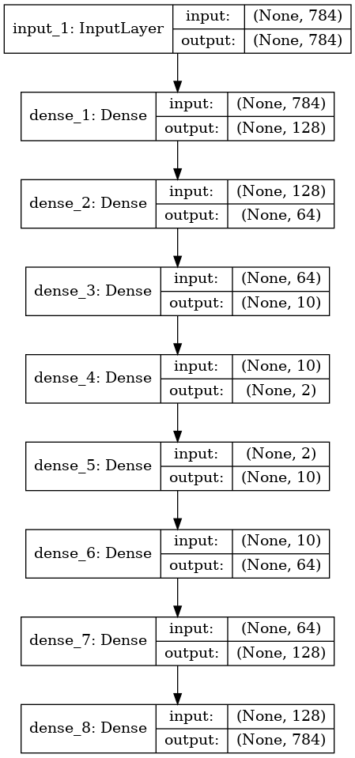
  
模型分为三个子模块,由上至下分别为输入层,多层编码器层和多层解码器层,编码器将输入维度为784(28 * 28)的mnint灰度值转化为一个维度为2的值.编码器将维度为2的值解码回维度为784(28 * 28)的mnint灰度值
  
使用python-keras代码实现关键代码如下.
  
```python
class DAE(ae.AE):
  
    def __init__(
        self, ENCODING_DIM_INPUT=784, ENCODING_DIM_LAYER1=128,
        ENCODING_DIM_LAYER2=64, ENCODING_DIM_LAYER3=10,
        ENCODING_DIM_OUTPUT=2,Name="dae" ):
        # input placeholder
        input_image = Input(shape=(ENCODING_DIM_INPUT, ))
  
        # encoding layer
        encode_layer1 = Dense(ENCODING_DIM_LAYER1,
                              activation='relu')(input_image)
        encode_layer2 = Dense(ENCODING_DIM_LAYER2,
                              activation='relu')(encode_layer1)
        encode_layer3 = Dense(ENCODING_DIM_LAYER3,
                              activation='relu')(encode_layer2)
        encode_output = Dense(ENCODING_DIM_OUTPUT)(encode_layer3)
  
        # decoding layer
        decode_layer1 = Dense(ENCODING_DIM_LAYER3,
                              activation='relu')(encode_output)
        decode_layer2 = Dense(ENCODING_DIM_LAYER2,
                              activation='relu')(decode_layer1)
        decode_layer3 = Dense(ENCODING_DIM_LAYER1,
                              activation='relu')(decode_layer2)
        decode_output = Dense(ENCODING_DIM_INPUT,
                              activation='tanh')(decode_layer3)
  
        # build surprised learning model
        SL_output = Dense(10, activation='softmax')(encode_output)
  
        # build autoencoder, encoder
        autoencoder = Model(inputs=input_image, outputs=decode_output)
        encoder = Model(inputs=input_image, outputs=encode_output)
        SL_model = Model(inputs=input_image, outputs=SL_output)
  
        # compile autoencoder
        autoencoder.compile(optimizer='adam', loss='mse', metrics=['accuracy'])
        SL_model.compile(optimizer='adam', loss='mse', metrics=['accuracy'])
```
  
代码定义了三个模型,分别是用于自监督训练的 autoencoder, 用于二维化的编码器 encoder 和用于进行有监督训练的 SL_model.
  
#### 训练过程
  
  
堆叠降噪自动编码器分为无监督的预训练过程和有监督的训练过程两部分.
本部分分别进行说明.
  
自监督的预训练过程loss变化情况如下.
  
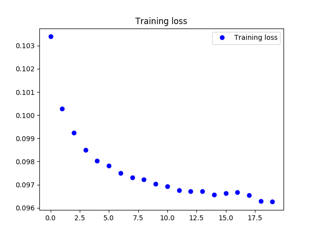
  
无监督的训练过程正确率acc变化情况如下.
  
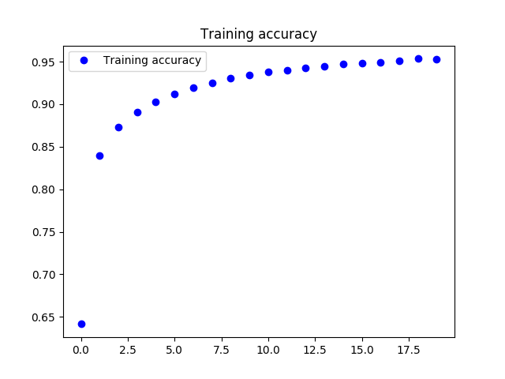
  
可以看到,在两个训练阶段,方法可以有效的达到收敛.
  
以下几点需要指出:
1. 多层编码器的训练没有使用栈式编码器的训练方式.
2. 预训练次数20epoch,并不足够模型充分收敛,但是作为预训练部分,已经充分.
3. 预训练部分的误差与传统自编码器相比较大,是因为在初始层加入了噪声的原因.
4. 训练时间与传统编码器相比更长,是其3倍左右.
5. 在有监督学习的开始阶段,分类的正确率并不高,这也印证了上一部分二位可视化的结果,很多点的界限不清晰.
  
#### 编码器输出的可视化结果
  
  
本节将从重建图像和编码器输出层的二维可视化图像两部分进行展示
  
**预训练部分**
  
重建图像
  
下图展示了添加噪声的效果(第一行原图,第二行增加噪声的图).
  
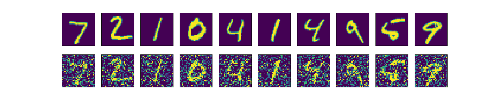
  
下图展示了,对添加噪声的图片进行重构的结果(第一行增加噪声的图,第二行重构图)
  
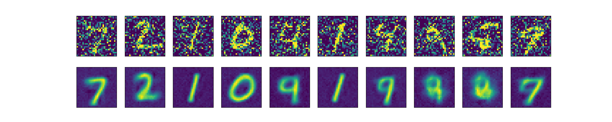
  
编码器输出层的二维可视化图像
  
下图展示了添加噪声的效果(第一行原图,第二行增加噪声的图).
  
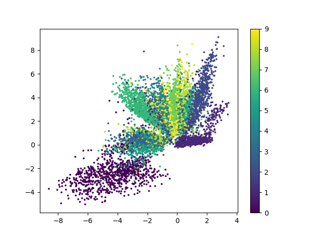
  
以下几点需要指出:
1. 本方法可以有效的对随机噪声进行去除
2. 恢复图与原图相比虽然能够识别但是效果更模糊
3. 与传统自动编码器相比,本方法得到的二维图的界限更加清晰
  
**有监督训练部分**
经过有监督的训练
  
重建图像(因为不是目标,所以必然走样)
下图展示了,对添加噪声的图片进行重构的结果(第一行增加噪声的图,第二行重构图)
  
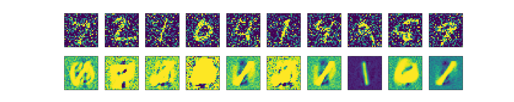
  
编码器输出层的二维可视化图像
  
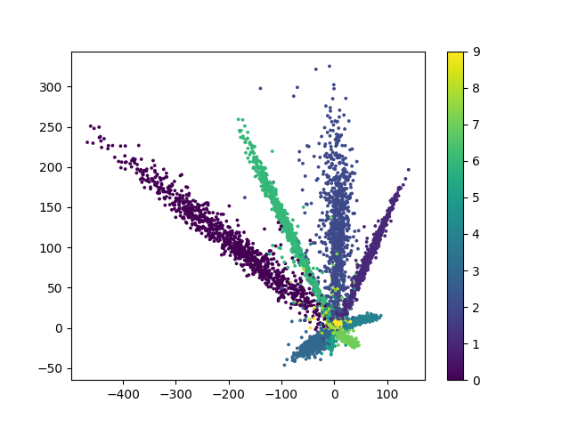
  
经过有监督学习,二维可视化图中各个组的界限更加清晰.
  
#### 说明与讨论
  
  
堆叠降噪自编码器的改进有以下启发:
1. 使用自监督预训练与有监督训练方式相结合的形式获得更加优秀的效果
2. 使用增加噪声的形式迫使模型学习更加有效的特征
3. 将深度玻尔兹曼姬的思想迁移到自动编码器中
  
  
### 3.3 卷积自编码器
  
#### 模型结构与实现代码
  
  
卷积自编码器自动编码器分为编码器部分和解码器部分,整体模型结构如图所示:
  
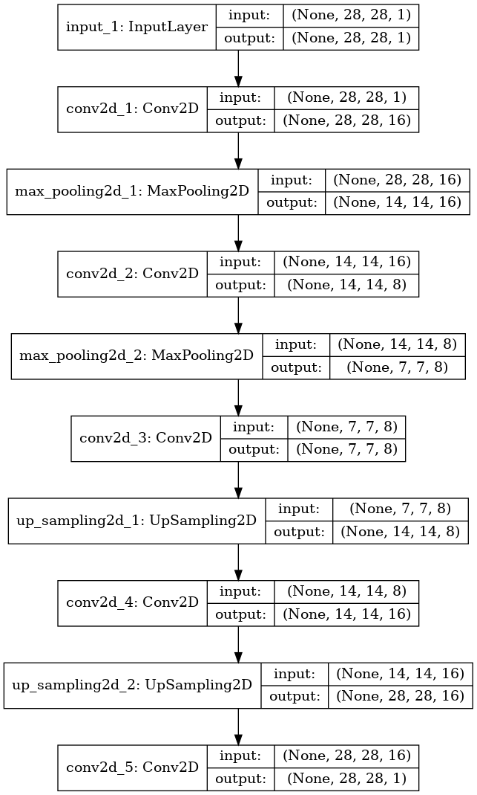
  
使用python-keras代码实现关键代码如下.
  
```python
    def __init__(self,CHANNEL_1 = 16,CHANNEL_2 = 8,CHANNEL_OUTPUT = 1,   Name="cae"):
        # input placeholder
        input_image = Input(shape=(28, 28, 1))
  
        # encoding layer
        x = Conv2D(CHANNEL_1, (3, 3), activation='relu', padding="same")(input_image)
        x = MaxPool2D((2, 2), padding='same')(x)
        x = Conv2D(CHANNEL_2, (3, 3), activation='relu', padding='same')(x)
        encode_output = MaxPool2D((2, 2), padding='same')(x)
  
        # decoding layer
        x = Conv2D(CHANNEL_2, (3, 3), activation='relu', padding='same')(encode_output)
        x = UpSampling2D((2, 2))(x)
        x = Conv2D(CHANNEL_1, (3, 3),activation='relu', padding='same')(x)
        x = UpSampling2D((2, 2))(x)
        decode_output = Conv2D(CHANNEL_OUTPUT, (3, 3), activation='sigmoid', padding='same')(x)
  
        # build surprised learning model
        encode_output_flatten = Flatten()(decode_output)
        SL_output = Dense(10, activation='softmax')(encode_output_flatten)
  
        # build autoencoder, encoder
        autoencoder = Model(inputs=input_image, outputs=decode_output)
        encoder = Model(inputs=input_image, outputs=encode_output)
        SL_model = Model(inputs=input_image, outputs=SL_output)
  
        # compile autoencoder
        autoencoder.compile(optimizer='adam', loss='binary_crossentropy', metrics=['accuracy'])
        SL_model.compile(optimizer='adam', loss='mse', metrics=['accuracy'])
```
  
#### 训练过程
  
  
堆叠降噪自动编码器分为无监督的预训练过程和有监督的训练过程两部分.
本部分分别进行说明.
  
在自监督的预训练过程loss变化情况如下.
  

  
图像显示,自监督的训练loss收敛于0.07左右,该误差比降噪自编码器的0.09要小.与传统自编码器的训练误差相差不多.但是从下文可知其训练效果明显优于传统自动编码器.
  
在有监督的训练过程正确率acc变化情况如下.
  
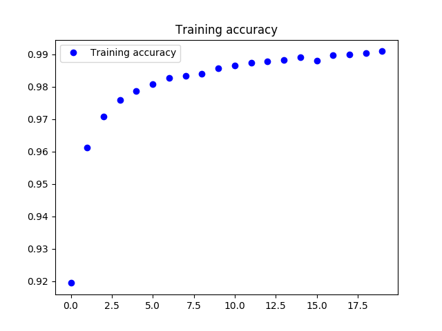
  
图像显示,有监督训练过程的正确率上升到0.99,比降噪自动编码器的正确(0.95)率更高.
因此在mnist数据集中的重建任务和分类任务中,卷积自动编码器有一定优势.
  
不过以下几点需要指出:
1. 与sDAE相比,CAE有更高的准确率和更低的损失
2. 更好的效果除了卷积单元能够更好的处理图像数据外,可能与CAE方法的复杂度更高和其瓶颈处通道更宽有关
  
#### 编码器输出的可视化结果
  
  
可以看到和stacked AE的主要区别在于局部卷积连接，而不所有层都是全连接。对图像和某些其他数据影响在空间局部的问题，比全连接更合适.因此效果更加优秀.
  
于降噪自动编码器相同,首先对图片增加噪声:
  

  
然后对增加噪声的图片进行去噪:
  
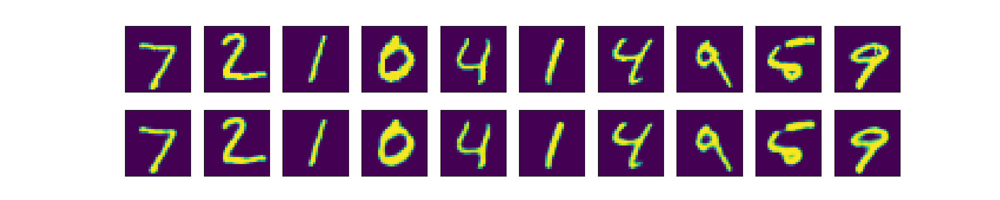
  
去噪结果比较优秀,与上文中所有的结果相比是最优秀的.
  
### 3.4 变分自编码器
  
#### 模型结构与实现代码
  
  
变分自动编码器的结构最为复杂,并且在模型中引入了隐变量,和KL散度等概率论概念.对模型的实现造成了一定的影响.
自动编码器分为编码器部分和解码器部分,整体模型结构如图所示:
  
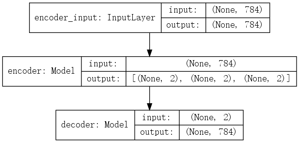
  
上图中并没有展开编码器和解码器的结构，编码器(encoder) 与 解码器(decoder)的形式分别如下：
  
encoder:
  
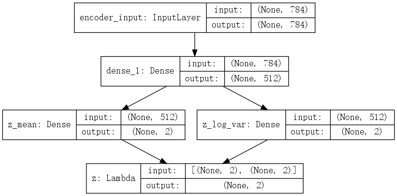
  
decoder:
  
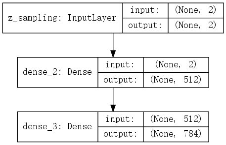
  
使用python-keras代码实现关键代码如下.
  
```python
class VAE(ae.AE):
  
    def __init__(
        self,
        ENCODING_DIM_INPUT = 784, 
        intermediate_dim = 512,
        batch_size = 128,
        latent_dim = 2,
        mse_loss = True,
        Name="vae"
    ):
  
        self.name = Name
  
        # input placeholder
        input_image = Input(shape=(ENCODING_DIM_INPUT,), name='encoder_input')
        # VAE model = encoder + decoder
        # encoding layer
        x = Dense(intermediate_dim, activation='relu')(input_image)
        z_mean = Dense(latent_dim, name='z_mean')(x)
        z_log_var = Dense(latent_dim, name='z_log_var')(x)
        z = Lambda(sampling, output_shape=(latent_dim,), name='z')([z_mean, z_log_var])
        # build decoder model
        latent_inputs = Input(shape=(latent_dim,), name='z_sampling')
        x = Dense(intermediate_dim, activation='relu')(latent_inputs)
        outputs = Dense(ENCODING_DIM_INPUT, activation='sigmoid')(x)
  
        # # build surprised learning model
        # SL_output = Dense(10, activation='softmax')()
  
        # build autoencoder, encoder
        encoder = Model(input_image, [z_mean, z_log_var, z], name='encoder')
        decoder = Model(latent_inputs, outputs, name='decoder')
        # SL_model = Model(inputs=input_image, outputs=SL_output)
  
        outputs = decoder(encoder(input_image)[2])
        autoencoder = Model(input_image, outputs, name='vae_mlp')
  
        # compile autoencoder
        # VAE loss = mse_loss or xent_loss + kl_loss
        if mse_loss:
            reconstruction_loss = mse(input_image, outputs)
        else:
            reconstruction_loss = binary_crossentropy(input_image,outputs)
  
        reconstruction_loss *= ENCODING_DIM_INPUT
        kl_loss = 1 + z_log_var - K.square(z_mean) - K.exp(z_log_var)
        kl_loss = K.sum(kl_loss, axis=-1)
        kl_loss *= -0.5
        vae_loss = K.mean(reconstruction_loss + kl_loss)
        autoencoder.add_loss(vae_loss)
        autoencoder.compile(optimizer='adam')
        autoencoder.summary()
  
        # SL_model.compile(optimizer='adam', loss='mse', metrics=['accuracy'])           
        self.autoencoder = autoencoder
        self.encoder = encoder
        self.decoder = decoder
```
  
#### 训练过程
  
  
由于,变分自动编码器主要应用于图像生成,而并非是提取与分类,因此变分降噪自动编码器只有自监督的训练过程..
  
在自监督的训练过程,使用 KL散度+交叉熵 作为loss函数,loss变化情况如下.
  
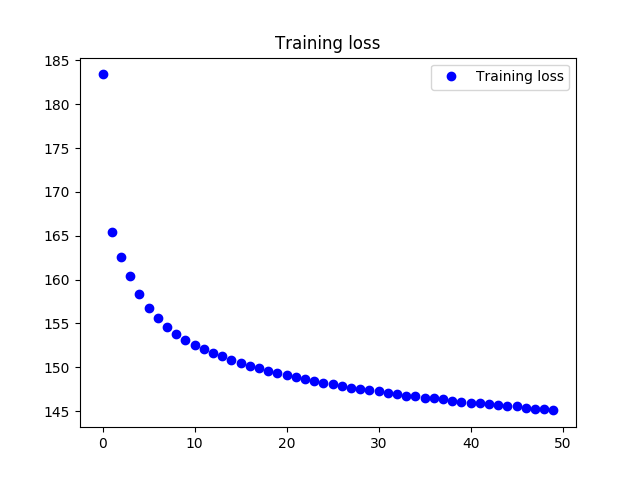
  
可以看散度可以收敛到145的情况,能够有效进行收敛.
  
在自监督的训练过程,使用 KL散度+方均根 作为loss函数,loss变化情况如下.
  

  
对于两种损失函数效果的讨论在下文中进行.
  
#### 自编码器输出的可视化结果
  
  
**使用  KL散度+交叉熵 作为损失函数**
  
基于kl散度的loss训练结果二维可视化如下
  
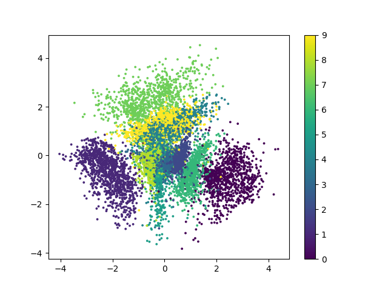
  
使用生成器对图像进行生成可以得到如下结果.
  
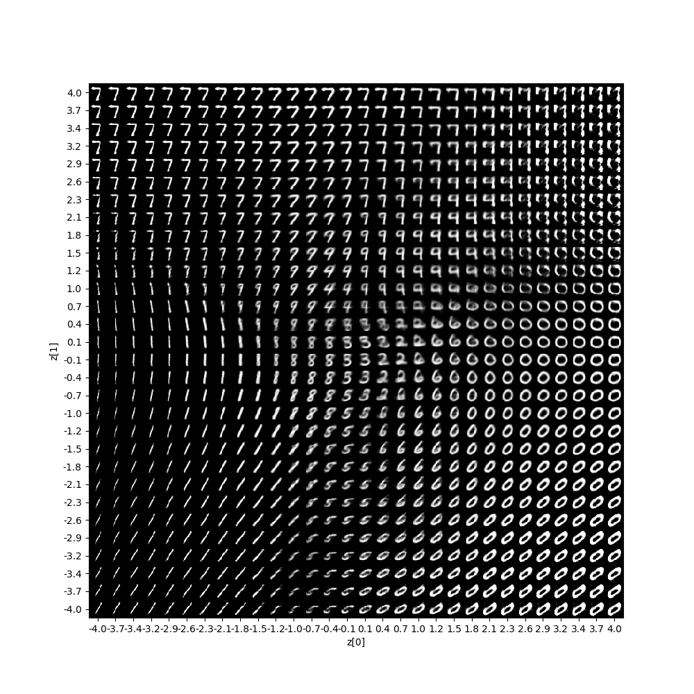
  
**使用 KL散度+方均根 作为损失函数**
  
基于kl散度的loss训练结果二维可视化如下
  
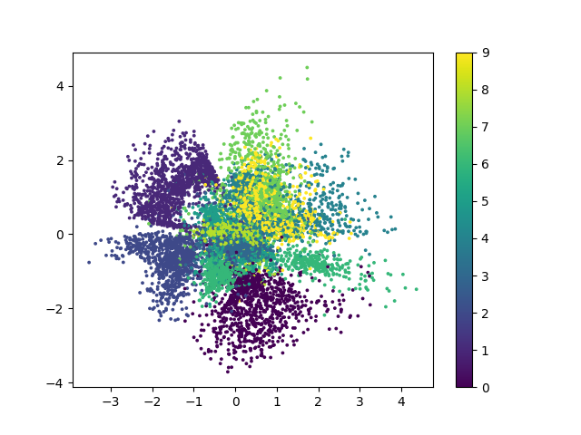
  
使用生成器对图像进行生成可以得到如下结果.
  
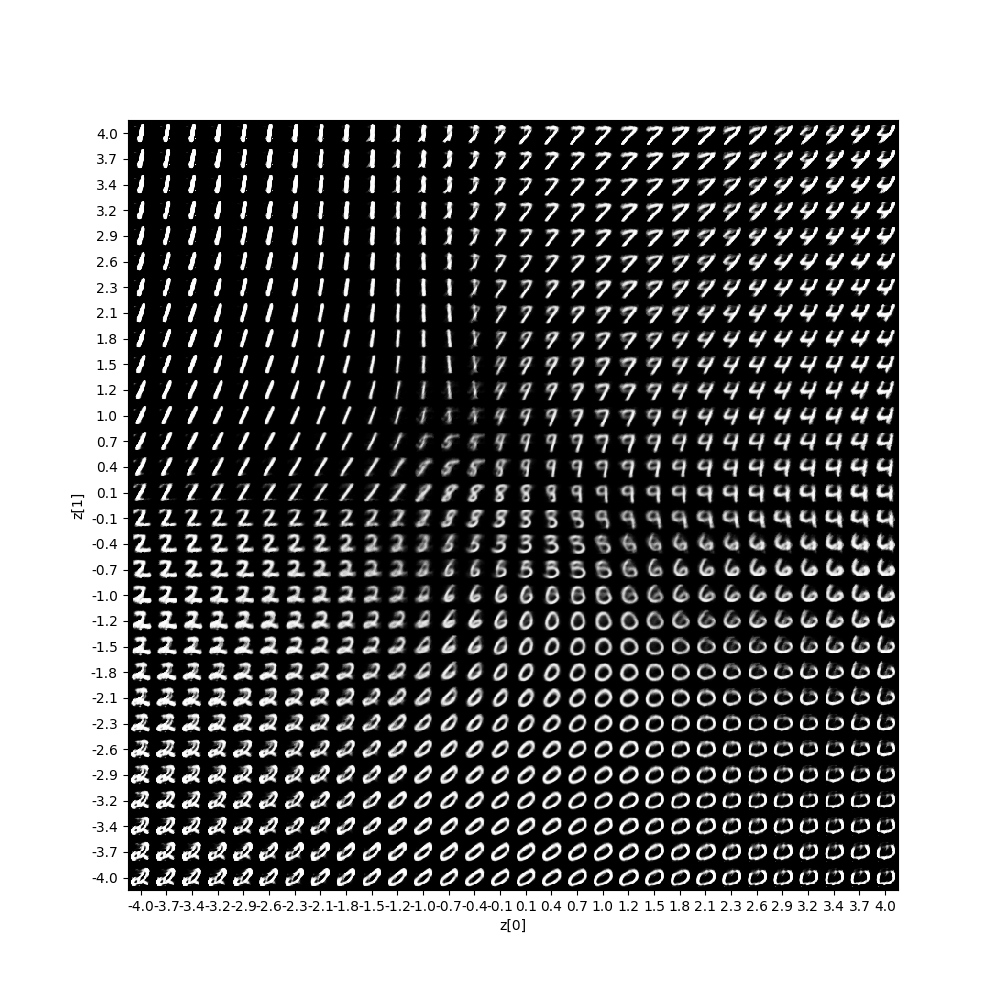
  
由于方均根与交叉熵的区别在于 解码器重现误差上面的区别,在编码器部分同样使用kl散度作为loss,因此两者的可视化结果类似.
  
以下几点需要指出:
1. 二维可视化的结果中各个类别的界限较为明显,且其分布十分集中方便生成模型的图像生成.
2. KL散度作为一种新的损失函数无法与其他方法的误差进行对比.
  
## 四.讨论
  
  
1. 自动编码器可能的应用有特征提取,图像分类,图像去燥,图像生成等
2. 在特征提取领域和图像分类领域使用sae有较优秀的效果
3. 在图像去噪领域可以使用cae方法,cae方法对二维图片的去燥效果十分优秀,但是由于中间部分是比较复杂的卷机核结构,无法进行有效的可视化
4. vae方法在图像生成领域有出色的表现,将中间的隐变量约束为正太分布的形式,十分方便的通过生成器完成图像生成.
5. 在研究角度,vae方法将概率方法引入神经网络的计算体系中,通过网络完成对概率分布的映射,使用散度的概念构造损失函数,对其他研究有些启发.
  
  
## 参考文献
  
  
1. Rumelhart, D. E., Hinton, G. E., & Williams, R. J. (1986). Learning representations by back-propagating errors. Nature. https://doi.org/10.1038/323533a0
2. Vincent, P., Larochelle, H., Bengio, Y., & Manzagol, P.-A. (2008). Extracting and composing robust features with denoising autoencoders. In Proceedings of the 25th international conference on Machine learning (pp. 1096–1103). ACM.
3. Masci, J., Meier, U., Cireşan, D., & Schmidhuber, J. (2011). Stacked convolutional auto-encoders for hierarchical feature extraction. In International Conference on Artificial Neural Networks (pp. 52–59). Springer.
4. Kingma, D. P., & Welling, M. (2013). Auto-Encoding Variational Bayes. ArXiv, (Ml), 1–14. Retrieved from http://arxiv.org/abs/1312.6114
  
  